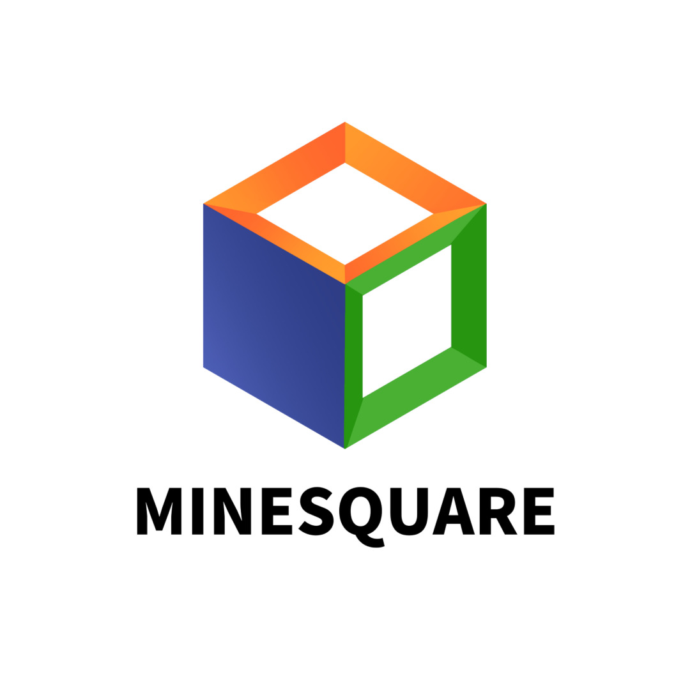

<p align="center"></p>

<h1 align="center">Minerica Launcher</h1>

<em><h5 align="center">(formerly Electron Launcher)</h5></em>
<em><h5 align="center">이 런처는 <a href="https://github.com/dscalzi/HeliosLauncher">Helios launcher</a>를 기반으로 만들어 졌습니다</h5></em>

[<p align="center">](https://github.com/dscalzi/HeliosLauncher/actions) [](https://github.com/dscalzi/HeliosLauncher/releases) </p>

<p align="center">대학교 마인크래프트 서버 Minerica에 접속하기 위한 런처로 </p>
<p align="center">다양한 최적화, 그래픽 모드를 포함하고 있습니다.</p>


## 다운로드

[GitHub Releases](https://github.com/djl987645/Minerica-Launcher/releases)에서 다운로드 받을 수 있습니다.

#### 현재 최신 릴리즈

[](https://github.com/djl987645/Minerica-Launcher/releases/latest) <-- 이 버튼을 클릭하면 다운로드 페이지로 이동합니다

**사용 가능한 플랫폼**

[Releases](https://github.com/djl987645/Minerica-Launcher/releases) 탭에서 다운받으실 경우, 본인의 시스템에 맞는 설치 파일을 다운로드해 주세요.<br>
각 플랫폼(OS)에 해당하는 파일 하나만 다운 받으시면 되니 참고해주세요.

| Platform                 | File                                          |
| ------------------------ | --------------------------------------------- |
| Windows              | `Minerica-Launcher-setup-VERSION.exe`           |
| macOS x64(구형)          | `Minerica-Launcher-setup-VERSION-x64.dmg`   |
| macOS arm64(M1 CPU 부터) | `Minerica-Launcher-setup-VERSION-arm64.dmg` |

macOS 사용자 분들은 실행이 안될시 터미널에 다음 명령어를 입력해주세요
```
xattr -cr "/Applications/Minerica Launcher.app"
```
해당 프로그램이 제대로 설치, 동작하지 않는 다면 사용하고 있는 백신에서 제외설정을 하셔야 할 수 있습니다.

## 미리보기


## 기능

- 🔒 전체 계정 관리.
  - 다중 계정 추가 및 쉽게 전환하기.
  - Microsoft (OAuth 2.0) + Mojang (Yggdrasil) 인증 완전 지원.
  - 자격 증명은 저장되지 않고 Mojang에 직접 전송됩니다.
- 📂 효율적인 자산 관리.
  - 업데이트를 발표하는 즉시 클라이언트 업데이트를 받으세요.
  - 파일은 시작 전에 검증됩니다. 손상되거나 잘못된 파일은 다시 다운로드됩니다.
- ☕ **자동 자바 검증.**
  - 호환되지 않는 자바 버전이 설치되어 있으면, 우리가 올바른 버전을 설치해 드립니다.
  - 런처를 실행하기 위해 자바가 설치되어 있을 필요는 없습니다.
- 📰 기본적으로 런처에 통합된 뉴스 피드.
- ⚙️ 직관적인 설정 관리, 자바 제어판 포함.
- 모든 서버 지원.
  - 서버 구성을 쉽게 전환합니다.
  - 선택된 서버의 플레이어 수를 봅니다.
- 자동 업데이트. 맞습니다, 런처는 스스로 업데이트합니다.
- Mojang 서비스의 상태를 확인합니다.

이것뿐만이 아닌 다양한 기능들을 직접 확인하세요!

#### 프로젝트가 마음에 드신다면 ⭐별로 관심을 표시하세요!


## 개발

이 섹션은 기본 개발 환경 설정에 대해 설명합니다.

### 시작하기

**시스템 요구 사항**

- [Node.js][nodejs] v20 이상

---

**복제 및 종속성 설치**

```console
> git clone https://github.com/djl987645/Minerica-Launcher.git
> cd HeliosLauncher
> npm install
```

---

**애플리케이션 실행**

```console
> npm start
```

---

**인스톨러 빌드**

현재 플랫폼용 빌드.

```console
> npm run dist
```

특정 플랫폼용 빌드.

| 플랫폼      | 명령어               |
| ----------- | -------------------- |
| Windows x64 | `npm run dist:win`   |
| macOS       | `npm run dist:mac`   |
| Linux x64   | `npm run dist:linux` |

macOS용 빌드는 Windows/Linux에서 작동하지 않을 수 있습니다.

---

### Visual Studio Code

런처의 모든 개발은 [Visual Studio Code][vscode]를 사용하여 수행해야 합니다.

다음을 코드를`.vscode/launch.json`에 붙여넣으세요.

```JSON
{
  "version": "0.2.0",
  "configurations": [
    {
      "name": "Debug Main Process",
      "type": "node",
      "request": "launch",
      "cwd": "${workspaceFolder}",
      "program": "${workspaceFolder}/node_modules/electron/cli.js",
      "args" : ["."],
      "outputCapture": "std"
    },
    {
      "name": "Debug Renderer Process",
      "type": "chrome",
      "request": "launch",
      "runtimeExecutable": "${workspaceFolder}/node_modules/.bin/electron",
      "windows": {
        "runtimeExecutable": "${workspaceFolder}/node_modules/.bin/electron.cmd"
      },
      "runtimeArgs": [
        "${workspaceFolder}/.",
        "--remote-debugging-port=9222"
      ],
      "webRoot": "${workspaceFolder}"
    }
  ]
}
```

이것은 두 가지 디버그 구성을 추가합니다.

#### Debug Main Process

이를 통해 Electron의 [main process][mainprocess]를 디버깅할 수 있습니다. [renderer process][rendererprocess]의 스크립트를 디버그하려면 DevTools 창을 엽니다.

#### Debug Renderer Process

이를 통해 Electron의 [renderer process][rendererprocess]를 디버깅할 수 있습니다. 이를 사용하려면 [Debugger for Chrome][chromedebugger] 확장 프로그램을 설치해야 합니다.

이 디버그 구성을 사용하는 동안 DevTools 창을 열 수 **없습니다**. Chromium은 한 번에 하나의 디버거만 허용하며, 다른 하나를 열면 프로그램이 충돌합니다.

---

### 타사 사용에 대한 참고

원래 저자에게 크레딧을 제공하고 원본 소스에 대한 링크를 제공하십시오. 이것은 무료 소프트웨어이므로 적어도 이 정도는 해주십시오.

Microsoft 인증 설정 지침은 [해당 링크](https://github.com/dscalzi/HeliosLauncher/blob/master/docs/MicrosoftAuth.md)에서 확인하세요.

---

## 자료

- [Wiki][wiki]
- [Nebula (Create Distribution.json)][nebula]
- [v2 Rewrite Branch (Inactive)][v2branch]

개발자에게 연락하는 가장 좋은 방법은 Discord입니다.

## [][discord]

[nodejs]: https://nodejs.org/en/ "Node.js"
[vscode]: https://code.visualstudio.com/ "Visual Studio Code"
[mainprocess]: https://electronjs.org/docs/tutorial/application-architecture#main-and-renderer-processes "Main Process"
[rendererprocess]: https://electronjs.org/docs/tutorial/application-architecture#main-and-renderer-processes "Renderer Process"
[chromedebugger]: https://marketplace.visualstudio.com/items?itemName=msjsdiag.debugger-for-chrome "Debugger for Chrome"
[discord]: https://discord.gg/zNWUXdt "Discord"
[wiki]: https://github.com/dscalzi/HeliosLauncher/wiki "wiki"
[nebula]: https://github.com/dscalzi/Nebula "dscalzi/Nebula"
[v2branch]: https://github.com/dscalzi/HeliosLauncher/tree/ts-refactor "v2 branch"
